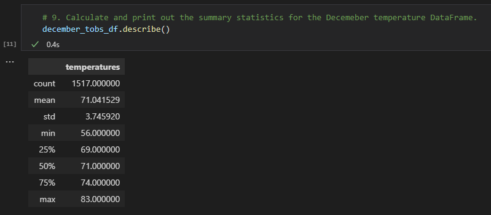
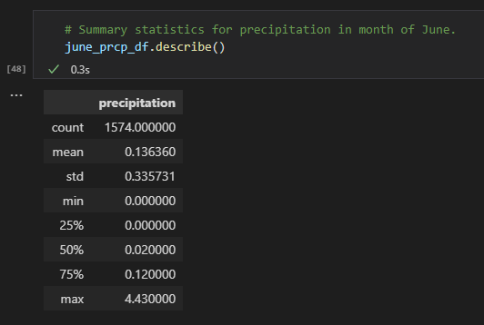

# Surf n' Shake Surf Shop: Statistical Analysis of Proposed Location (Oahu, Hawaii)

## Process High-Level Overview: 
- Created a SQLite Database
  - A SQLite Database differs from a PostgreSQL database in that the "database" is essentially a flat file that resides locally on my computer. It is a quick way to set up a database without requiring a server and offers most of the capabilities of a server-based SQL database. One disadvantage of a SQLite database is that is has fewer security features than a server-based SQL database.   
- Utilized SQLAlchemy to make a connection between our SQLite database and Python (VS Code, Jupyter notebook extension).
- Utilized VS Code's Jupyter notebook extension to write the code for our weather analysis. 
- Utilized SQLAlchemy to query our SQLite database from within Python (VS Code, Jupyter notebook extension).
- Utilized pandas to create DataFrames of our data and run descriptive statistics.

## Overview of the Statistical Analysis:

The purpose of the requested statistical analysis was to help our client, W. Avy, better understand temperature trends in Oahu, Hawaii. 

In addition to the analysis requested by W. Avy, we decided to conduct an additional statistical analysis to evaluate precipitation amounts in Oahu in June versus December. See below for these additional queries. 

The results of these statistical analyses will help W. Avy decide if Oahu is an ideal location for his Surf n' Shake shop and ensure that his combination business is sustainable year-round.

### Temperature Observation Queries - June vs. December: 

To accomodate W. Avy's original request for a statistical analysis of temperature difference between June and December, we utilized the following queries: 

```
# 2. Convert the June temperatures to a list.
# Need to remove the date so have a list of only June temps
june_results = []
june_results = session.query(Measurement.tobs).filter(extract('month', Measurement.date) == 6).all()
print(june_results)
```

```
# 3. Create a DataFrame from the list of temperatures for the month of June. 
june_tobs_df = pd.DataFrame(june_results, columns=['temperatures'])
june_tobs_df.head(15)
```

```
# 4. Calculate and print out the summary statistics for the June temperature DataFrame.
june_tobs_df.describe()
```

```
# 7. Convert the December temperatures to a list.
december_results = []
december_results = session.query(Measurement.tobs).filter(extract('month', Measurement.date) == 12).all()
print(december_results)
```

```
# 8. Create a DataFrame from the list of temperatures for the month of December. 
december_tobs_df = pd.DataFrame(december_results, columns=['temperatures'])
december_tobs_df.head(15)
```

```
# 9. Calculate and print out the summary statistics for the Decemeber temperature DataFrame.
december_tobs_df.describe()
```

### Additional Queries - Precipitation - June vs. December:

To provide W. Avy with additional information to help him confirm Oahu as an ideal location for his business, I wrote additional queries to evaluate the differences in precipitation amounts between the months of June and December: 

```
# Convert the June precipitation amounts to a list.
june_prcp_results = []
june_prcp_results = session.query(Measurement.prcp).filter(extract('month', Measurement.date) == 6).all()
print(june_prcp_results)
```

```
# Create a DataFrame from the list of precipitation amounts for the month of June. 
june_prcp_df = pd.DataFrame(june_prcp_results, columns=['precipitation'])
june_prcp_df.head(15)
```

```
# Summary statistics for precipitation in month of June.
june_prcp_df.describe()
```

```
# Convert the December precipitation amounts to a list.
december_prcp_results = []
december_prcp_results = session.query(Measurement.prcp).filter(extract('month', Measurement.date) == 12).all()
print(december_prcp_results)
```

```
# Create a DataFrame from the list of precipitation amounts for the month of December. 
december_prcp_df = pd.DataFrame(december_prcp_results, columns=['precipitation'])
december_prcp_df.head(15)
```

```
# Summary statistics for precipitation in the month of December
december_prcp_df.describe()
```

## Descriptive Statistics: 

### June Temperature Observations:


### December Temperature Observations:



### June Precipitation Amounts:



### December Precipitation Amounts:


## Results: Oahu Key Weather Different (June vs. December)

The descriptive statistics hightlight some key differences in weather between June and December: 

- Minimum Temperature: 
  - Based on our data, the minimum temperature was 64 degrees in June versus 56 degrees in December. It would be expected for business to be slower at the Surf n' Shake during colder weather.
- 25th Percentile: Temperature:
  - The 25th percentile for temperature was 73 degrees in June versus 69 degrees in December. 
  - Therefore, while the minimum temperature in December was 56 degrees, only 25% of temperatures in December were below 69 degrees. This is encouraging for business because 56 degree temperatures are not the norm in December in Oahu. 
- Mean Temperature: 
  - The mean temperature in June was 74.94 degrees versus 71.04 in December. There is nearly a 4 degree difference in the mean temperature; however, this difference does not seem likely to negatively impact business.  

## Summary:
- There is a high-level summary of the results. 
- Given that the data is over 5 years old, it would be interesting to conduct this analysis on more current data to determine the impact of climate change on the weather in Oahu, Hawaii and its possible impacts on Surf n' Shop's business.

